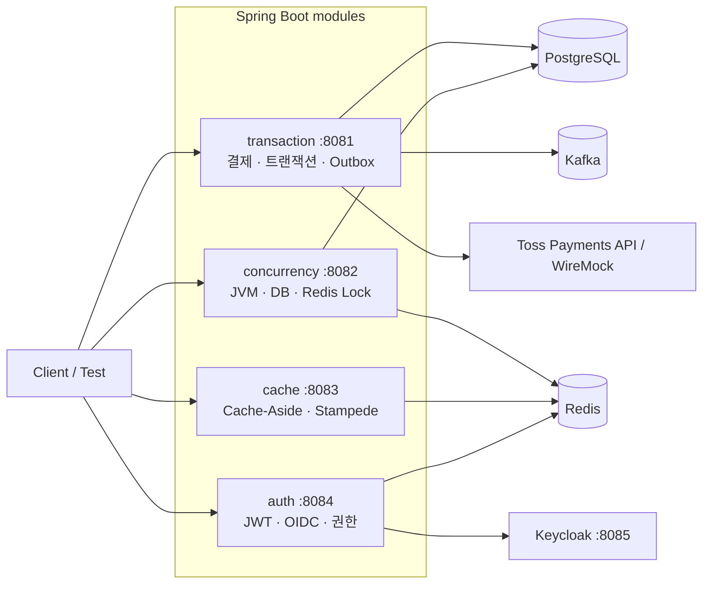

# Kotlin Backend Study

[](https://github.com/Ji-Hyeong/backend-study/actions/workflows/ci.yml)

Kotlin과 Spring Boot로 백엔드 주제를 직접 구현하고 복습하는 저장소입니다.

트랜잭션, 동시성, 캐시, 인증을 작은 애플리케이션과 테스트로 나누어 정리합니다. 궁금한 동작을 테스트로 재현한 뒤, 구현 방식과 한계를 문서에 남깁니다.

## 공부한 내용

| 모듈 | 주제 | 정리 |
| --- | --- | --- |
| `apps:transaction` | 트랜잭션 전파·격리·롤백, 외부 결제, Outbox/Inbox, Kafka | [Transaction](docs/transaction.md) |
| `apps:concurrency` | lost update, JVM·DB·Redis 락, 낙관적 락 재시도 | [Concurrency](docs/concurrency.md) |
| `apps:cache` | Cache-Aside, cache stampede, stale data, negative caching | [Cache](docs/cache.md) |
| `apps:auth` | JWT, Refresh Token Rotation, OIDC, RBAC·ReBAC·ABAC | [Authentication](docs/auth.md) |

## 구성



결제 상태 전이와 Outbox/Inbox 흐름은 [구조와 실패 흐름](docs/architecture.md)에서 시퀀스 다이어그램으로 정리했습니다.

각 모듈은 독립 실행 가능한 Spring Boot 애플리케이션입니다. 모듈 경계를 분리해 한 주제의 설정과 실패가 다른 실험에 영향을 주지 않도록 구성했습니다.

## 테스트

- `transaction`과 `concurrency` 통합 테스트는 PostgreSQL Testcontainers에서 실행해 실제 DB의 트랜잭션·락 동작을 검증합니다.
- 결제 HTTP 어댑터는 WireMock으로 인증 헤더, 멱등 키, 응답·오류 매핑을 계약 테스트합니다.
- 동시성 테스트는 `CountDownLatch`로 동일 읽기 시점과 동시 쓰기 시작점을 제어합니다.
- Outbox 테스트는 발행 전 종료, 발행 후 상태 기록 실패, 중복 소비, 순서 공백과 lease 만료를 구분해 검증합니다.
- 모든 push와 pull request에서 GitHub Actions가 전체 테스트를 실행합니다.

```bash
./gradlew test
```

특정 주제만 확인할 수도 있습니다.

```bash
./gradlew :apps:transaction:test
./gradlew :apps:concurrency:test
./gradlew :apps:cache:test
./gradlew :apps:auth:test
```

## 실행하기

### 필요한 환경

- JDK 17+
- Docker with Compose

### 인프라 실행

```bash
docker compose -f docker/docker-compose.yml up -d
```

PostgreSQL, Redis, Kafka와 Keycloak을 실행합니다. 로컬 서버의 기본 설정은 빠른 탐색을 위해 H2를 사용하며, Redis·Kafka·Keycloak 실험은 Docker 인프라를 연결합니다. 데이터베이스 의미론이 중요한 자동화 테스트는 H2가 아니라 PostgreSQL Testcontainers를 사용합니다.

### 애플리케이션 실행

```bash
./gradlew :apps:transaction:bootRun
./gradlew :apps:concurrency:bootRun
./gradlew :apps:cache:bootRun
./gradlew :apps:auth:bootRun
```

## 사용 기술

- Kotlin 1.9, Java 17
- Spring Boot 3.5, Spring Data JPA, Spring Security, Spring Kafka
- PostgreSQL 16, Redis 7, Kafka 3.9, Keycloak 26
- JUnit 5, Testcontainers, WireMock
- Gradle multi-project, Docker Compose, GitHub Actions

## 정리 방법

1. 궁금한 동작이나 실패 조건을 먼저 적습니다.
2. 작은 예제와 테스트로 직접 재현합니다.
3. 여러 구현 방식을 비교하고 각각의 한계를 기록합니다.
4. 나중에 다시 볼 수 있도록 실행 방법과 관련 문서를 함께 남깁니다.
