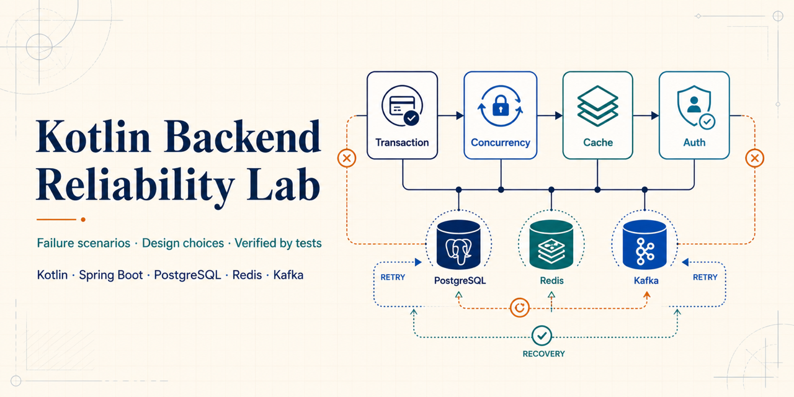
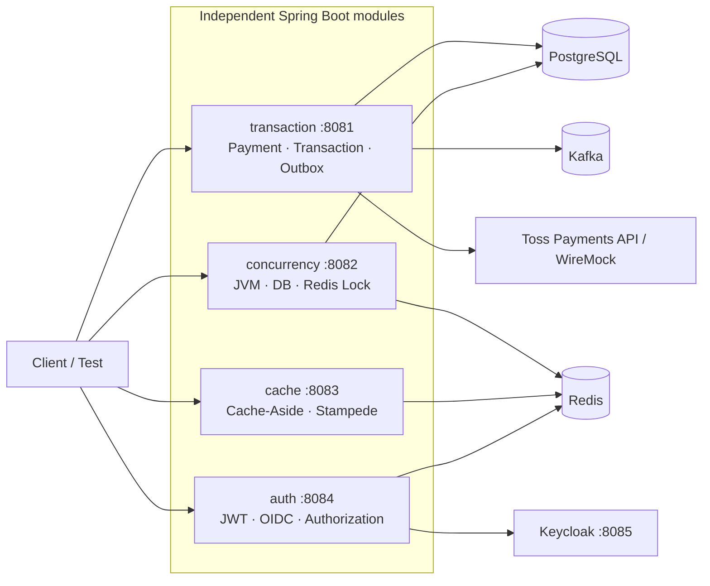

# Kotlin Backend Reliability Lab



[](https://github.com/Ji-Hyeong/backend-study/actions/workflows/ci.yml)

운영 환경에서 발생하는 백엔드 실패를 코드와 테스트로 재현하고, 설계 선택의 효과와 한계를 검증하는 Kotlin/Spring Boot 모노레포입니다.

프레임워크 사용법을 나열하기보다 결제 결과 미확정, 이벤트 유실·중복, 동시 갱신, 캐시 불일치, 토큰 탈취와 같은 실패 조건을 먼저 정의합니다. 각 실험은 **실패 재현 → 개선 구현 → 회귀 테스트 → 운영 시 주의점** 순서로 구성합니다.

## What This Repository Demonstrates

| Module | Failure Scenario | Design Choice | Evidence |
| --- | --- | --- | --- |
| `apps:transaction` | PG 타임아웃으로 승인 여부를 확정할 수 없음 | 주문 선커밋, 미확정 상태, 조회·웹훅 재조정 | [Payment tests](apps/transaction/src/test/kotlin/com/jihyeong/study/transaction/externalio/PaymentApprovalFlowTests.kt) |
| `apps:transaction` | DB 커밋과 이벤트 발행 사이 유실·중복 | Transactional Outbox, Inbox 멱등 처리, aggregate 순서 검증 | [Outbox tests](apps/transaction/src/test/kotlin/com/jihyeong/study/transaction/outbox/OutboxInboxTransactionTests.kt) |
| `apps:transaction` | 다중 relay worker가 같은 이벤트를 발행 | lease 기반 compare-and-set claim, 실패 반환과 재시도 | [Relay tests](apps/transaction/src/test/kotlin/com/jihyeong/study/transaction/outbox/OutboxInboxTransactionTests.kt) |
| `apps:concurrency` | 동시 재고 차감의 lost update | JVM·비관적·낙관적·Redis 락 비교 | [Concurrency tests](apps/concurrency/src/test/kotlin/com/jihyeong/study/concurrency/inventory/InventoryConcurrencyTests.kt) |
| `apps:cache` | cache stampede와 stale data | Cache-Aside, single-flight, negative caching | [Cache tests](apps/cache/src/test/kotlin/com/jihyeong/study/cache/product/ProductCacheTests.kt) |
| `apps:auth` | refresh token 재사용과 권한 경계 혼재 | Rotation, 재사용 감지, RBAC·ReBAC·ABAC 분리 | [Auth tests](apps/auth/src/test/kotlin/com/jihyeong/study/auth/refresh/AuthServiceTests.kt) |

## Architecture



결제 상태 전이와 Outbox/Inbox 전달 보장 범위는 [Architecture & Failure Flows](docs/architecture.md)에서 시퀀스 다이어그램으로 설명합니다.

## Modules

| Module | Port | Topics | Deep Dive |
| --- | ---: | --- | --- |
| `apps:transaction` | 8081 | 전파·격리·Rollback, 외부 결제, Outbox/Inbox, Kafka | [Transaction](docs/transaction.md) |
| `apps:concurrency` | 8082 | lost update, JVM/DB/Redis 락, 낙관적 락 재시도 | [Concurrency](docs/concurrency.md) |
| `apps:cache` | 8083 | Cache-Aside, stampede, stale data, negative caching | [Cache](docs/cache.md) |
| `apps:auth` | 8084 | JWT, Refresh Token Rotation, OIDC, RBAC/ReBAC/ABAC | [Authentication](docs/auth.md) |

각 모듈은 독립 실행 가능한 Spring Boot 애플리케이션입니다. 모듈 경계를 분리해 한 주제의 설정과 실패가 다른 실험에 영향을 주지 않도록 구성했습니다.

## Test Strategy

- `transaction`과 `concurrency` 통합 테스트는 PostgreSQL Testcontainers에서 실행해 실제 DB의 트랜잭션·락 동작을 검증합니다.
- 결제 HTTP 어댑터는 WireMock으로 인증 헤더, 멱등 키, 응답·오류 매핑을 계약 테스트합니다.
- 동시성 테스트는 `CountDownLatch`로 동일 읽기 시점과 동시 쓰기 시작점을 제어합니다.
- Outbox 테스트는 발행 전 종료, 발행 후 상태 기록 실패, 중복 소비, 순서 공백과 lease 만료를 구분해 검증합니다.
- 모든 push와 pull request에서 GitHub Actions가 전체 테스트를 실행합니다.

```bash
./gradlew test
```

특정 주제만 확인할 수도 있습니다.

```bash
./gradlew :apps:transaction:test
./gradlew :apps:concurrency:test
./gradlew :apps:cache:test
./gradlew :apps:auth:test
```

## Run Locally

### Requirements

- JDK 17+
- Docker with Compose

### Infrastructure

```bash
docker compose -f docker/docker-compose.yml up -d
```

PostgreSQL, Redis, Kafka와 Keycloak을 실행합니다. 로컬 서버의 기본 설정은 빠른 탐색을 위해 H2를 사용하며, Redis·Kafka·Keycloak 실험은 Docker 인프라를 연결합니다. 데이터베이스 의미론이 중요한 자동화 테스트는 H2가 아니라 PostgreSQL Testcontainers를 사용합니다.

### Applications

```bash
./gradlew :apps:transaction:bootRun
./gradlew :apps:concurrency:bootRun
./gradlew :apps:cache:bootRun
./gradlew :apps:auth:bootRun
```

## Stack

- Kotlin 1.9, Java 17
- Spring Boot 3.5, Spring Data JPA, Spring Security, Spring Kafka
- PostgreSQL 16, Redis 7, Kafka 3.9, Keycloak 26
- JUnit 5, Testcontainers, WireMock
- Gradle multi-project, Docker Compose, GitHub Actions

## Study Principles

1. 실패 조건과 예상 상태를 문서에 먼저 적습니다.
2. 실패와 개선을 같은 테스트 경계에서 비교합니다.
3. 결과뿐 아니라 트랜잭션, 락, 토큰과 메시지 전달 경계를 설명합니다.
4. `exactly-once` 같은 과도한 표현 대신 보장 범위와 남는 실패 가능성을 명시합니다.
5. 운영에서 사용할 때 필요한 재시도, 관측성, 보상과 자원 비용을 함께 기록합니다.
