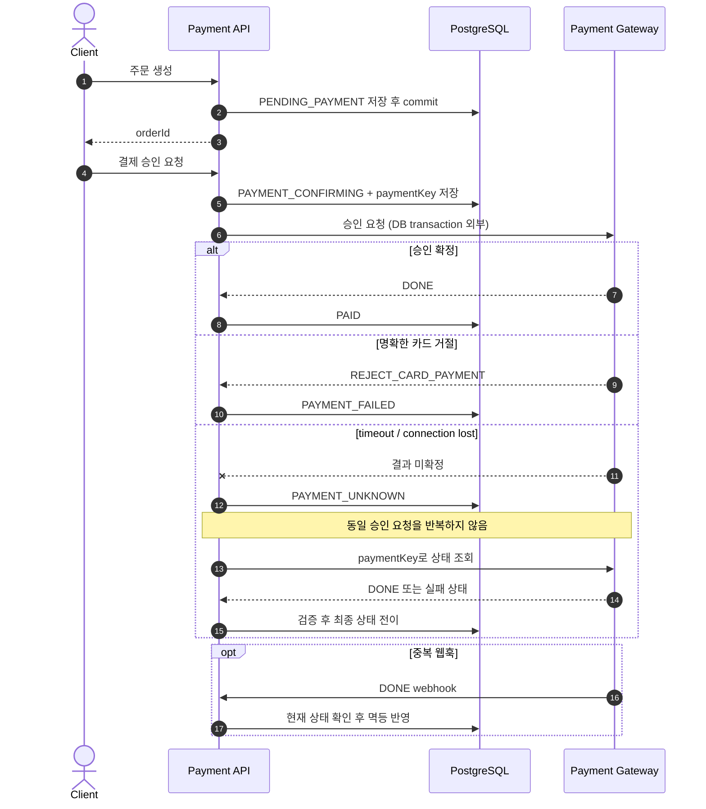
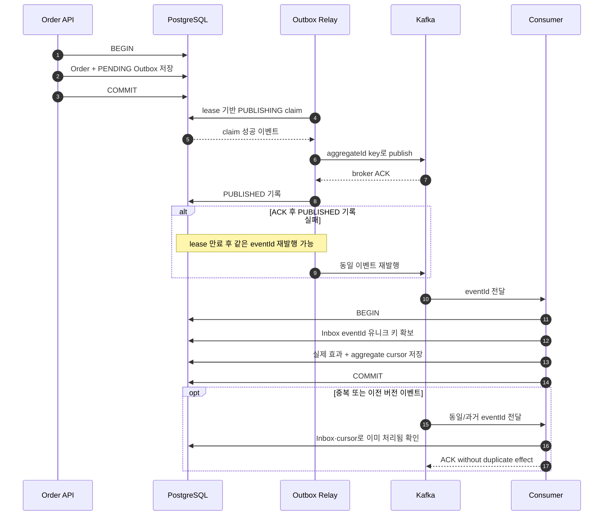
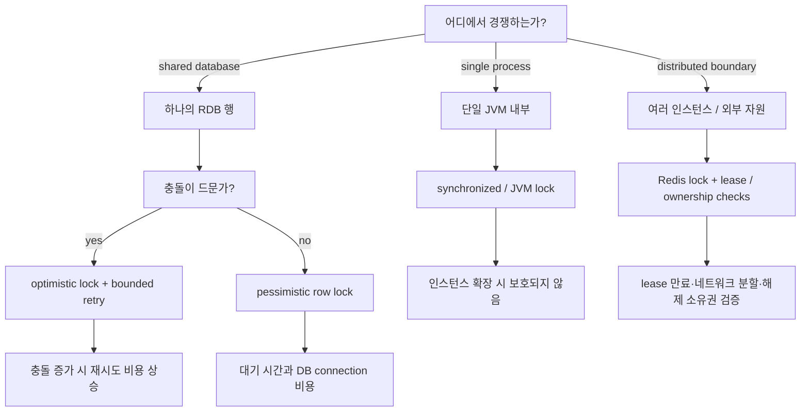

# Architecture & Failure Flows

이 문서는 대표 실험의 정상 경로보다 **실패가 발생했을 때 상태가 어떻게 남고 복구되는지**를 설명합니다.

## Payment: Unknown Is Not Failure

원격 결제 승인 요청의 타임아웃은 결제 실패를 의미하지 않습니다. PG에서는 승인됐지만 응답만 유실됐을 수 있으므로, 같은 결제를 다시 승인하지 않고 조회 또는 웹훅으로 결과를 재조정합니다.

검증 코드:

- [PaymentApprovalFlowTests](../apps/transaction/src/test/kotlin/com/jihyeong/study/transaction/externalio/PaymentApprovalFlowTests.kt)
- [PaymentWebhookTests](../apps/transaction/src/test/kotlin/com/jihyeong/study/transaction/externalio/PaymentWebhookTests.kt)
- [TossPaymentGatewayWireMockTests](../apps/transaction/src/test/kotlin/com/jihyeong/study/transaction/externalio/TossPaymentGatewayWireMockTests.kt)

## Outbox/Inbox: Prefer Duplicate Over Loss

주문과 Outbox 이벤트는 같은 로컬 트랜잭션에 저장합니다. 브로커 발행과 DB 상태 갱신은 하나의 원자적 작업이 아니므로, 전송 성공 후 상태 기록에 실패하면 같은 이벤트가 다시 발행될 수 있습니다. 소비자는 Inbox와 실제 효과를 같은 트랜잭션으로 묶어 중복 전달을 한 번의 효과로 제한합니다.

이 구조의 보장 범위는 다음과 같습니다.

- 주문과 Outbox 기록: 하나의 DB 트랜잭션으로 원자 저장
- 이벤트 발행: 유실보다 중복을 허용하는 at-least-once
- 소비 효과: `eventId` 유니크 키와 로컬 트랜잭션 범위의 effectively-once
- aggregate 순서: 버전 cursor로 과거 이벤트 무시, 순서 공백 재시도
- 제외 범위: 네트워크와 브로커를 포함한 end-to-end exactly-once

검증 코드:

- [OutboxInboxTransactionTests](../apps/transaction/src/test/kotlin/com/jihyeong/study/transaction/outbox/OutboxInboxTransactionTests.kt)
- [KafkaStudyEventListenerTests](../apps/transaction/src/test/kotlin/com/jihyeong/study/transaction/outbox/KafkaStudyEventListenerTests.kt)

## Concurrency: Choose the Boundary First

락은 강도 순서로 선택하는 기능이 아니라, 경쟁 범위와 실패 비용에 맞춰 선택합니다.

검증 코드:

- [InventoryConcurrencyTests](../apps/concurrency/src/test/kotlin/com/jihyeong/study/concurrency/inventory/InventoryConcurrencyTests.kt)
- [RedisInventoryLockService](../apps/concurrency/src/main/kotlin/com/jihyeong/study/concurrency/redis/RedisInventoryLockService.kt)
